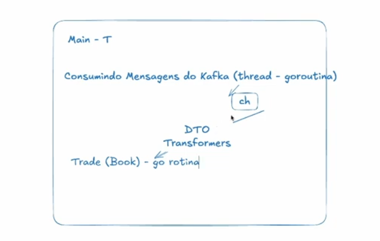

 # Go Lang project to simulate a broker
 Used to simulate brokers, it uses kafka to process and handle messages
 
 
 
 ### Create project
 type in 
 ```bash
 go mod init github.com/wilferraciolli/fullCycle-homeBroker/go-simulator               
 ```

 ### Install dependencies
 ```bash
 go mod tidy
 ```

### Run the project
on the terminal type in
```bash
  go run cmd/trade/main.go
```

## Kafka admin
It uses the control-center docker image to manage kafka topics, run the docker compose then on the browser go to 
`localhost:9021`
## Kafka topics
Using kafka's control center admin, create the 2 topics this application uses `orders` and `processed_orders`

## Dependencies
### Google - UUID
### Confluentinc - Apache kafka 

// TODO stoped lessioon 5 56:00
// TODO stoped lessioon 5 56:00
// TODO stoped lessioon 5 56:00


